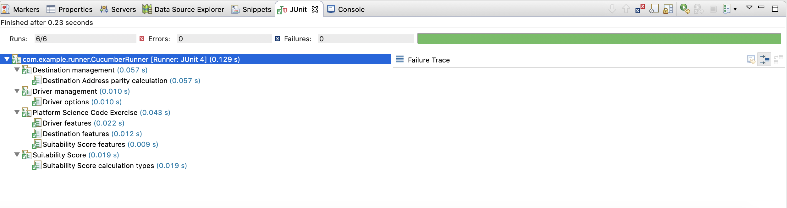
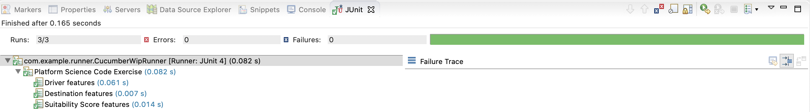

# PlatformScienceCodeExercise

This implementation was done using Java, Maven, JUnit and CucumberJVM.

This is a library to be implemented in any kind of client, can be Desktop, Web or API Rest application.

The following Scenarios document how it works, including some concrete examples.

### Screenshots

Test Run

Overview of the Main Objects

