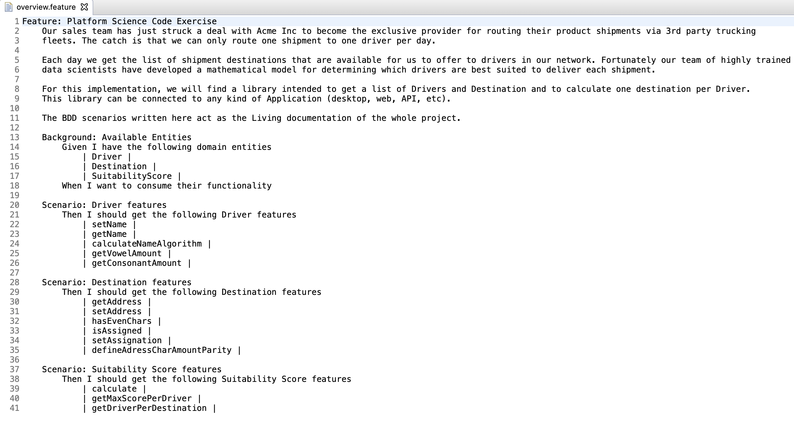

# PlatformScienceCodeExercise

This implementation was done using Java, Maven, JUnit and CucumberJVM.

This is a library to be implemented in any kind of client, can be Desktop, Web or API Rest application.

The following Scenarios document how it works, including some concrete examples.

### Screenshots

### Test Run

### Overview of the Main Objects
This is a small scenario intended to design the shape of the principal objects to be consumed. It would be nice to have some more scenarios to exercise each function but due to time restrictions for now we have only this one.

### Driver Feature

### Destination Feature

### Suitability Score Feature

